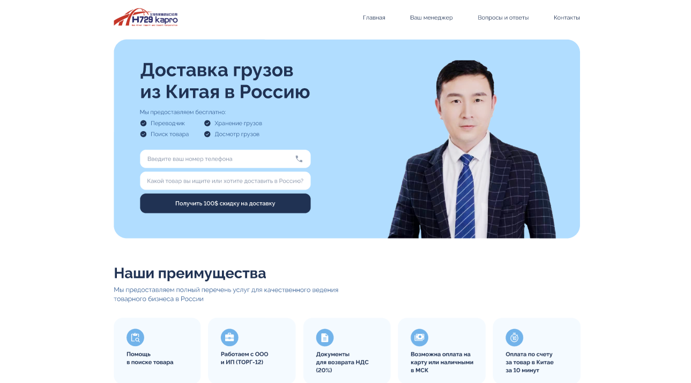

# 🏗️ Kapro — корпоративный сайт компании

Адаптивный лендинг, выполненный по макету из [Figma](https://www.figma.com/design/pbcdMCuNJaG5MyjkQYYp7s/Kapro?node-id=182-6396&t=4JGQ1orouonvVhOu-0).

---

## 📸 Превью проекта

  
---

## 🚀 Особенности проекта

- Полностью адаптивная вёрстка под **десктоп** и **мобильные устройства**  
- Семантичная **HTML5-разметка**  
- Современные возможности **CSS** — Flexbox, Grid, `clamp()`, медиа-запросы  
- Система **переиспользуемых блоков**  
- **Pixel Perfect** вёрстка по макету Figma  
- Кроссбраузерная совместимость  
- Поддержка **Retina-дисплеев**   

---

## 🧱 Используемые технологии

- **HTML5**  
- **CSS3 / SCSS**  
- **Figma** (в качестве источника дизайна)  
- Методология **BEM**  

---

## 📱 Адаптивность

Сайт адаптирован под следующие разрешения:

| Устройство | Разрешение |
|-------------|-------------|
| 💻 Десктоп | ≥ 1200px |
| 📱 Планшет | ≥ 768px |
| 📱 Мобильные устройства | ≥ 320px |

---

## ⚙️ Установка и запуск проекта

```bash
# Клонируем репозиторий
git clone https://github.com/username/kapro.git

# Переходим в директорию проекта
cd kapro

# Открываем в браузере
index.html
```
👨‍💻 Автор

Exmar — Fullstack Developer

📧 Telegram: @Exmar1


